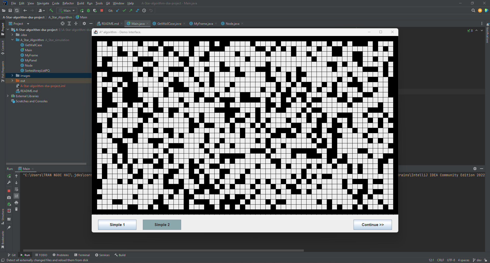
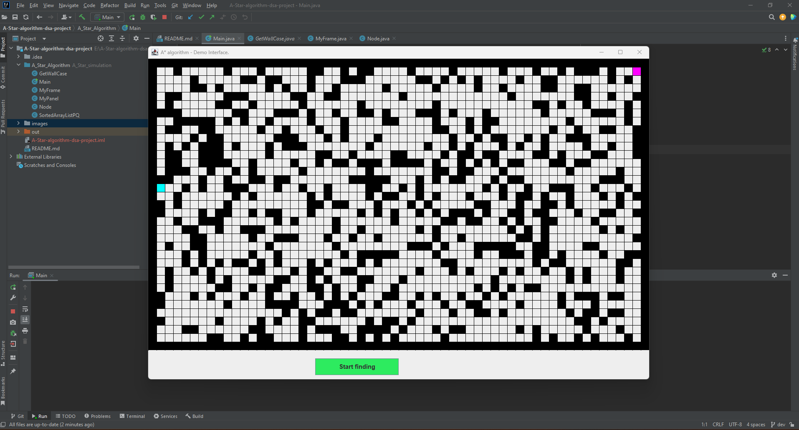
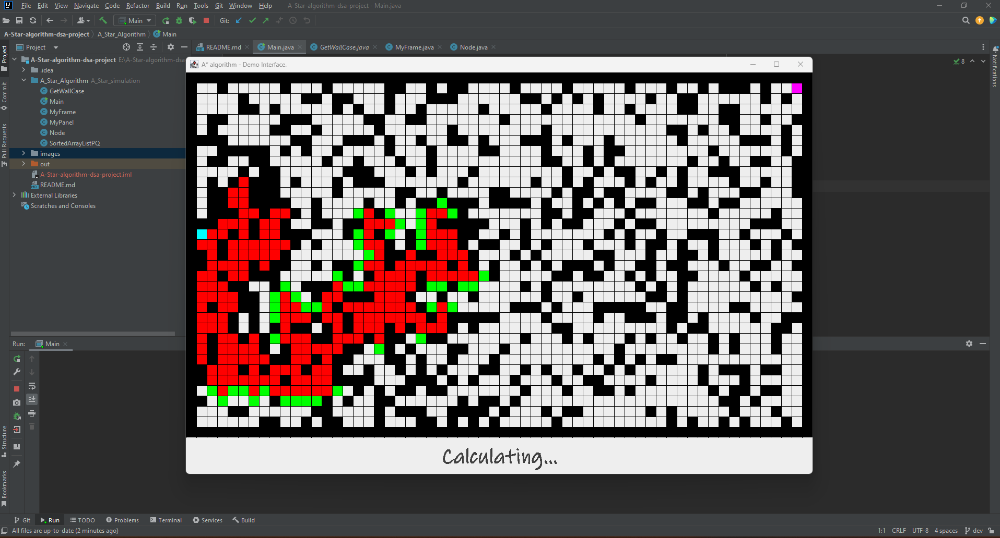
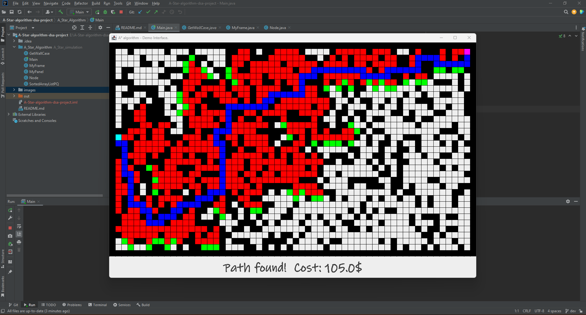

# A* algorithm 
This code belongs to TranHai167!

Detailed report: [Report_DSA_CK.docx](https://github.com/TranHai167/A-Project/files/10130914/Report_DSA_CK.docx)

This is how my algorithm works:

1. First step is to select the map you want to practice:

   
2. Second, check the start and destination point:

3. After clicking find button, algorithm start running. The red refer to visited point while green is waiting point:
   

4. Finally success! The path is shown on the screen and also for it's cost:
   
